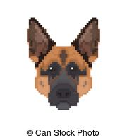

Criando **MINHA PÁGINA PRINCIPAL**.

# Quem sou eu?  
sou um estudante que não sei o que fazer da vida.

# Produções

## Games
  
[jogo 3](https://lucas-manolo.github.io/Invoke/)

## Artes

## Apresentações

 * aula de música  
 * aula de teatro  
 * aula de jogos  
 1 Marcelo  
 2 boy Durva  
 
## Artes feita para os jogos

* * *
** negrito  
_ _ italico  
~~ traço no nome  
  dois espaços para pular linha.  
  3* com espaçamento entre eles, irá acarretar em uma linha na horizontal.  
  #'s criam capítulos ou sub. ( e o número de hashtags irá influênciar no tamanho da fonte)  
  *s adiciona uma lista n numerda.  
  Nº adiciona uma lista numerada.  
  * * *
