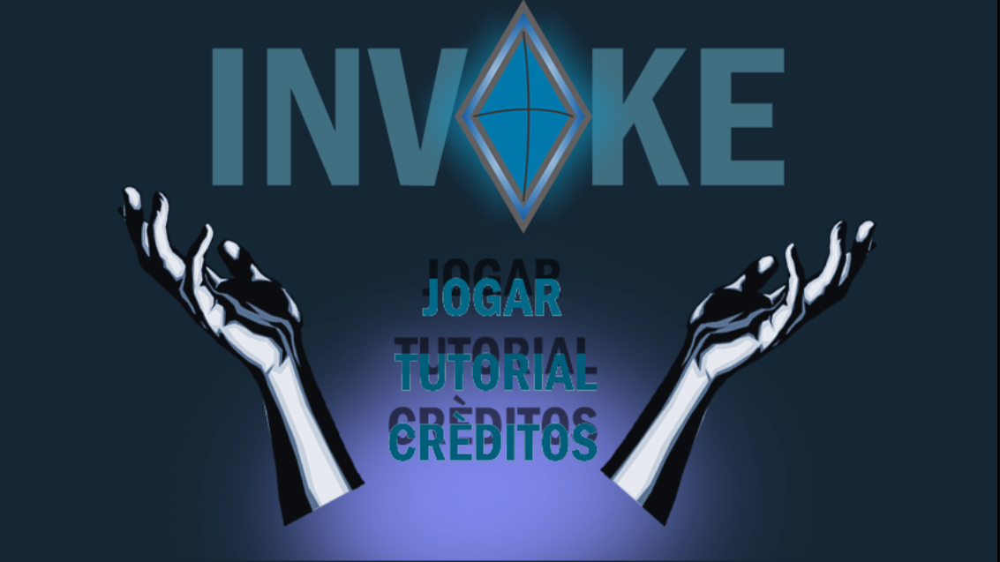

# Meu Portifolio

# Quem sou eu?  
sou um estudante do IFRN ( Campus Ceará-mirim ) que não sei o que fazer da vida. Curso o 3º ano de Jogos Digitais.

# Produções

## Games
Esses são alguns jogos que fiz, juntamente com alguns colegas.
  

## Artes
* * *
**algumas artes do primeiro jogo**    
   
* * *

## Animaçoes
Essa foi uma animação que fiz de Pixel Arte, achei legal :v  

* * *
** negrito  
_ _ italico  
~~ traço no nome  
  dois espaços para pular linha.  
  3* com espaçamento entre eles, irá acarretar em uma linha na horizontal.  
  #'s criam capítulos ou sub. ( e o número de hashtags irá influênciar no tamanho da fonte)  
  *s adiciona uma lista n numerda.  
  Nº adiciona uma lista numerada.  
  * * *
