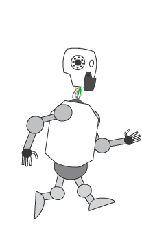

# Meu Portifolio

# Quem sou eu?  
 **créditos ao meu brodi Neto, tmj <3**  
Sou um estudante do IFRN ( Campus Ceará-mirim ) que não sei o que fazer da vida. Curso o 3º ano de Jogos Digitais.Tento fazer algumas **ARTES** para a disciplina de Oficina, porém, nunca sai como planejado(acho que é porque falta um pouco de **chanfro**).  
* * *
### contatos  
email: jv12345592@gmail.com  
 

* * *
# Produções

## Jogos
**Esses são alguns jogos que fiz, juntamente com alguns colegas.**  
Bom Apetite.
 
Óculos que tudo vê  

Invoke  
  

## Artes  
* * *
**algumas artes do primeiro jogo**    
   
  
* * *
**algumas artes do segundo jogo**  
    
  
* * *
**algumas artes do terceiro jogo**  
   
  
* * * 

## Aleatoriedades
Essa foi uma animação que fiz de Pixel Art.Achei legal :v  
  
Essa foi uma das aventuras na disciplina de Multimidia(não recomendo, principalmente se você fazer se tiver coração fraco). O objetivo era fazer animações com imagens autorais.  
  
   
e.e  

* * *

