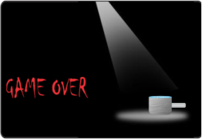

# Meu Portifolio

# Quem sou eu?  
 **_créditos ao meu brodi Neto, tmj <3_**  
Sou um estudante do IFRN ( Campus Ceará-mirim ) que não sei o que fazer da vida. Curso o 3º ano de Jogos Digitais.Tento fazer algumas artes para a disciplina de Oficina, nunca sai como planejado(acho que é porque falta um pouco de **chanfro**).  
email: jv12345592@gmail.com  
telefone: (084) 9 9204-4778  

# Produções

## Games
**Esses são alguns jogos que fiz, juntamente com alguns colegas.**  
Bom Apetite.
 
Óculos que tudo vê  

Invoke  
  
Ataque dos Vírus  

## Artes
* * *
**algumas artes do primeiro jogo**    
   
  
* * *
**algumas artes do segundo jogo**  
    
  
* * *
**algumas artes do terceiro jogo**  
   
  
* * * 

## Aleatoriedades
Essa foi uma animação que fiz de Pixel Art, achei legal :v  
  

[[email]](https://mail.google.com/mail/u/0/#inbox)  

* * *
** negrito  
_ _ italico  
~~ traço no nome  
  dois espaços para pular linha.  
  3* com espaçamento entre eles, irá acarretar em uma linha na horizontal.  
  #'s criam capítulos ou sub. ( e o número de hashtags irá influênciar no tamanho da fonte)  
  *s adiciona uma lista n numerda.  
  Nº adiciona uma lista numerada.  
  * * *
